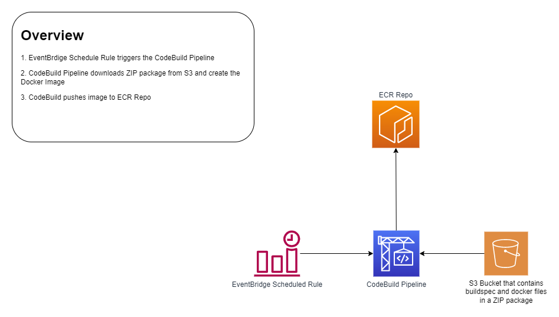

# Jenkins ECS CoudeBuild Module

This modules creates a CodeBuild Project that creates an image from the latest Jenkins Docker Image and stores in ECR.

# Variables

|Variable                        | Description                                             | Default Value           |
|--------------------------------|---------------------------------------------------------|-------------------------|
|`ProjectName`            	     | The name of the CodeBuild project                       | ECS-Jenkins-Image-Build |
|`SourceBucket`            	     | The name of the S3 bucket where the ZIP package resides |                         |
|`SourceKey`                     | The name of the ZIP package (i.e. ecs-jenkins.zip)      | ecs-jenkins.zip         |
|`RepoName`                      | The name of the ECR Repo to upload image to             | ecs-jenkins             |

# Overview

